## 10分で始めよう

最新バージョン OpenRTM-aist-1.2.0-RELEASE では C++版、Python版、Java版 がインストールされます。
また、rtshell も同時にインストールされます。

### Python 2.7 のインストール

Python 2.7 をインストールしていない場合は、OpenRTM-aist をインストールすることができません。
OpenRTM-aist をインストールする前に、Python 2.7 をインストールしてください。

Python 2.7 のダウンロードは OpenRTM-aist-1.2.0-RELEASE(index#download) をご覧ください。

インストールを実行した際に、以下の画面で [Add python.exe to Path] を [Will be installed on local hard drive] に設定してください。
こうすると、python.exe と Scripts に Path を自動で設定してくれます。（例：Path=C:\Python27\; C:\Python27\Scripts;...）

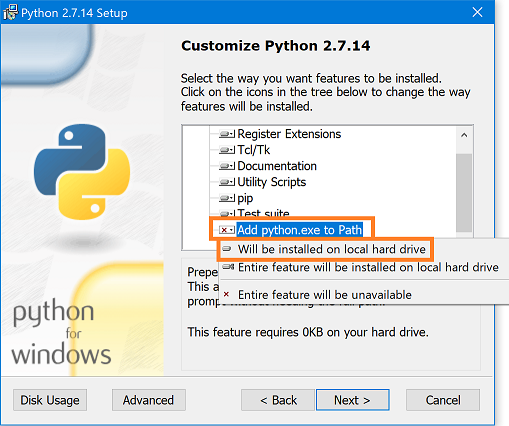

### OpenRTM-aist のインストール

ここでは Windows10 で 32bit 用インストーラー OpenRTM-aist-1.2.0-RELEASE_x86.msi を使ったインストール手順を紹介します。

インストーラーのダウンロードは OpenRTM-aist-1.2.0-RELEAS(index#download) をご覧ください。

#### インストール手順
1. インストーラーを起動して [次へ] をクリックします。

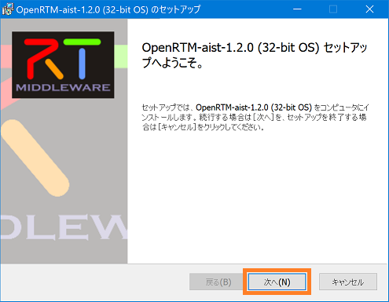

2. 使用承諾契約書のページです。ソフトウェアライセンス条項に同意して [次へ] をクリックします。

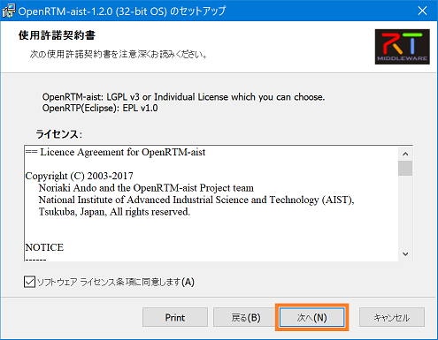

3.インストールの種類を選択します。デフォルトのまま [次へ] をクリックします。 

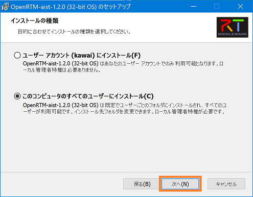

4.Visual Studio のバージョンを選択します。

C++版で使用する Visual Studio のバージョンをシステム環境変数に設定します。
インストールされている Visual Studio のバージョンを選択して [次へ] をクリックします。

※Visual Studio のダウンロードは OpenRTM-aist-1.2.0-RELEASE <ページ作成中> をご覧ください。
※システム環境変数 RTM_VC_VERSION の設定は、インストール終了後に VCVerChanger で変更することができます。
( VCVerChangerの使い方 )＜リンク＞
※Python版、Java版では無関係ですのでデフォルトのまま [次へ] をクリックしてください。 

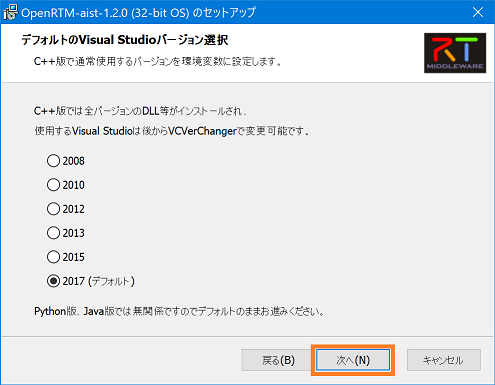

5. セットアップの種類を選択します。
[標準] を選択した場合、OpenRTM-aist の C++版、Java版、Python版、OpenRTP、RTSystemEditorRCP、RTShell、OpenRTM-aist-C++版の Visual Studio 2008 から 2017 までのランタイムライブラリ、OpenRTM-aist-1.0.0 から 1.1.2 までのランタイムライブラリがインストールされます。特に変更理由がないようであれば [標準] をクリックします。 

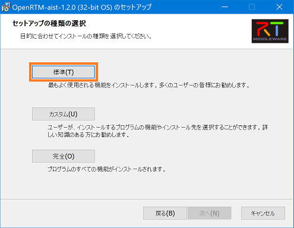

6. [インストール] をクリックするとインストールが開始されます。 

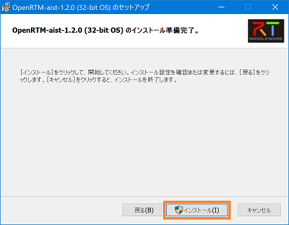

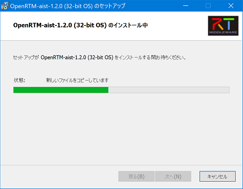

7. インストールが終了しました。[完了] をクリックしてインストーラーを終了します。 

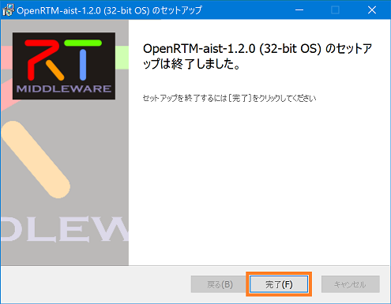

※使用している Visual Studio のバージョンが 2017(vc14) 以外の場合は、以下のページを参考に環境変数の RTM_VC_VERSION を変更してください。
RTM_VC_VERSIONの変更＜リンク＞

### サンプルコンポーネントを実行する

必須ではありませんが、ここからはスタートメニューに登録されたアプリケーションを多数起動します。毎回スタートメニューから順番にたどるのは大変ですので、 スタートボタンからスタートメニューを表示させ [OpenRTM-aist 1.2.0 x86] > [OpenRTP] を右クリックして [ファイルの場所を開く] を選択してください。 

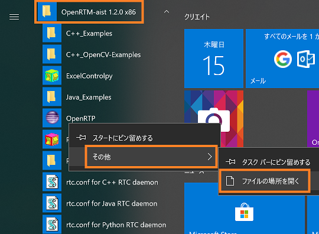

<b>ファイルの場所を開く</b>

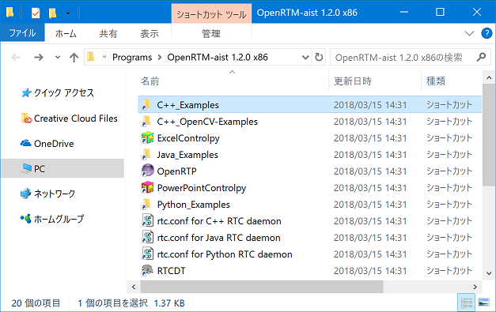

<b>スタートメニューフォルダー</b>

このように、スタートメニューのフォルダーが開かれ、様々なアプリケーションにアクセスしやすくなります。 では、インストールされたサンプルコンポーネントを実行してみます。

#### ConsoleInComp、ConsoleOutCompを使用する

ConsoleInComp、ConsoleOutComp は DataInPort、DataOutPort の使用方法を示したサンプルです。ConsoleIn 側で入力した数字が，ConsoleOut 側に表示されます。 

##### rtm-naming の起動

Start Naming Service をクリックします。以下のようなコンソール画面が表示されます。 

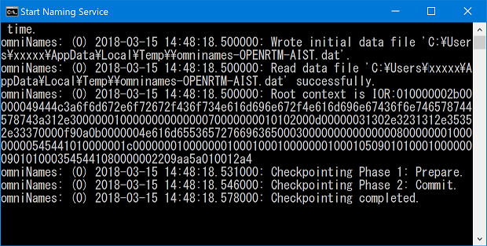

<b>Start Naming Service</b>

##### サンプルコンポーネント起動

[OpenRTM-aist 1.2.0 x86] > [C++_Example] フォルダー内の ConsoleIn.bat と ConsoleOut.bat をクリックします。以下のようなコンソール画面が表示されます。 

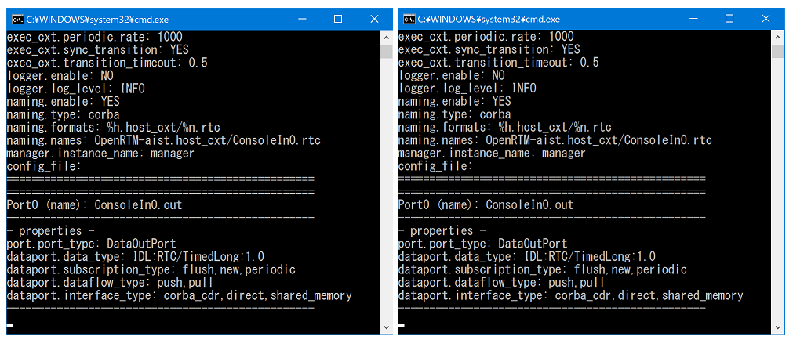
  

<b>ConsoleIn.bat と ConsoleOut.bat</b>

##### OpenRTP起動

[OpenRTM-aist 1.2.0 x86] フォルダー内の OpenRTP をクリックして起動します。 ワークスペースは適当な場所を指定してください。 

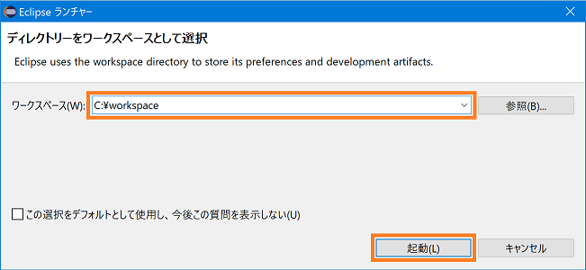

<b>ワークスペースの選択</b>

「ようこそ」画面は今のところ必要ないので左上の [ようこそ] タブの [×] ボタンをクリックして画面を閉じてください。 

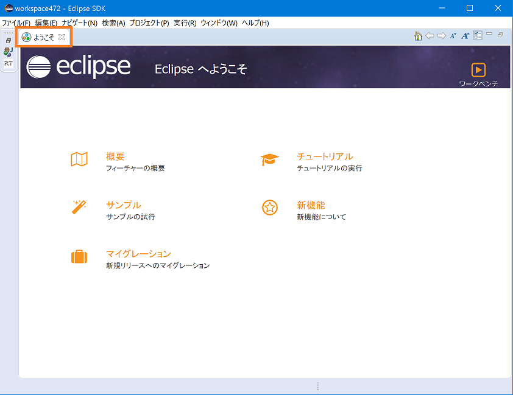

<b>初期起動時の画面</b>

画面右上の [パースペクティブを開く] をクリックします。表示されるダイアログで [RT System Editor] を選択して [開く] をクリックすると RTSystemEditor が起動します。 

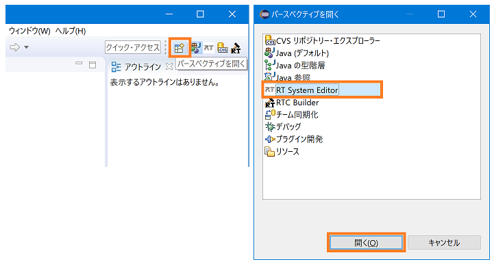
  

<b>パースペクティブの切り替え</b>

NameServiceView にコンポーネントが表示されます。最初は折りたたまれているため表示されていませんが、[>] をクリックし展開すると、ConsoleIn、ConsoleOut コンポーネントが確認できます。 

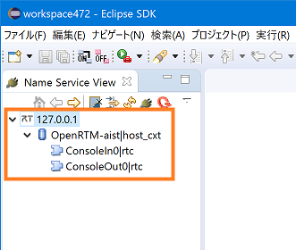

<b>コンポーネント起動確認</b>

※NameServerView にネームサーバーが表示されない時は、手動で localhost を追加します。画像の [ネームサーバを追加] をクリックしてダイアログを表示します。「localhost」 と入力し [OK] をクリックして追加します。 

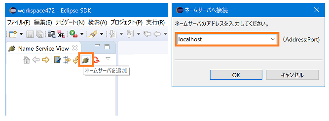
  

<b>ネームサーバの追加</b>

ツールバーから [Open New System Editor] をクリックして、System Diagram を表示します。 

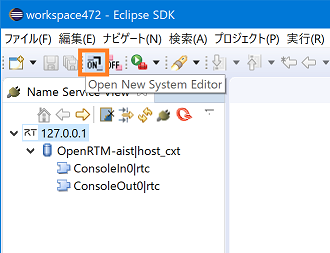

<b>System Diagramを表示</b>

NameServiceView にある ConsoleIn、ConsoleOut のコンポーネントを System Diagram上にドラッグ＆ドロップすると、以下の画像のように表示されます。 

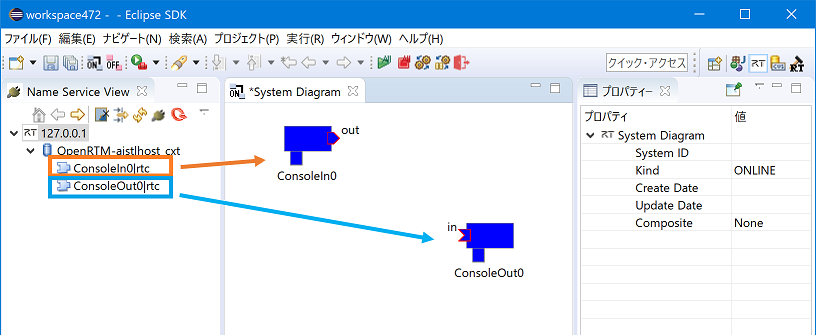

<b>コンポーネントをドラッグ＆ドロップ</b>

データポート間でドラッグ＆ドロップしてコンポーネントを接続します。その後、接続に必要な情報の入力を促すダイアログが表示されるので [OK] をクリックします。 

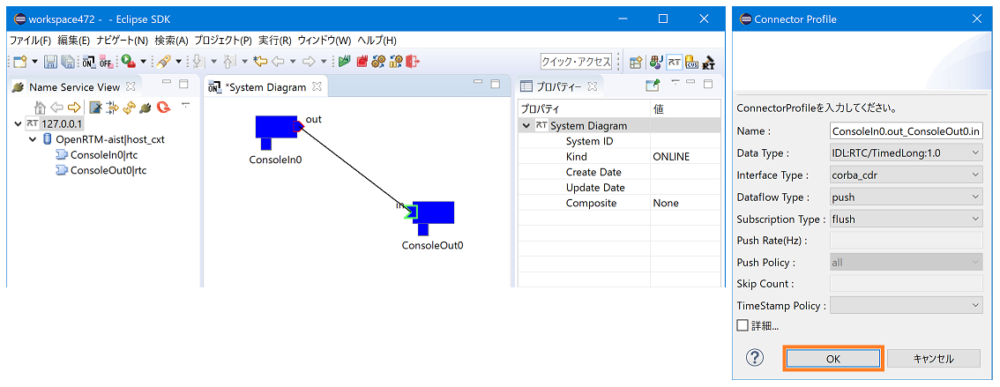
 

<b>コンポーネント接続</b>

以下の画像のように接続されます。 

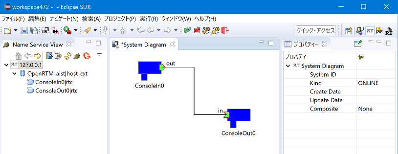

<b>接続完了</b>

コンポーネントの状態を Activate にします。[All Activate] クリックしてください。コンポーネントの色が青から明るい緑に変わったら成功です。コンポーネントは個別に選択して Activate にすることも可能です。 

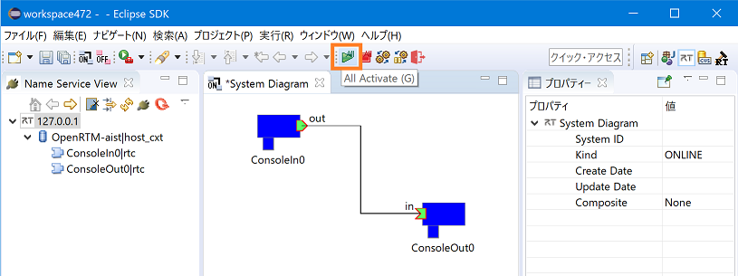

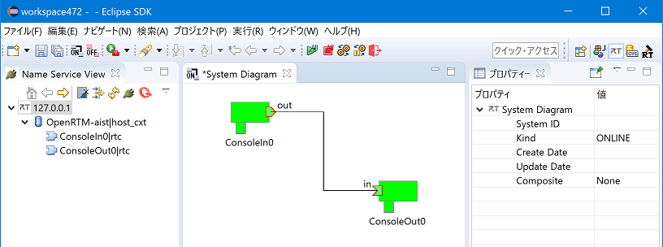

<b>Activate 完了</b>

#### コンソール画面での動作確認

次にコンソール画面で動作確認します。RTSystemEditor で接続後、ConsoleIn 画面に「Please input number:」と表示されます。 

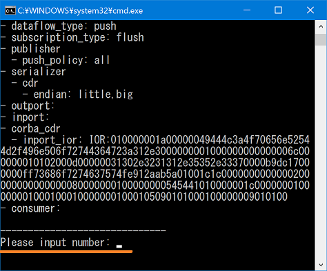

<b>「Please input number:」と表示</b>

ConsoleIn 画面で任意の数値を入力し [Enter] を押すと、ConsoleOut 画面に数値が表示されます。

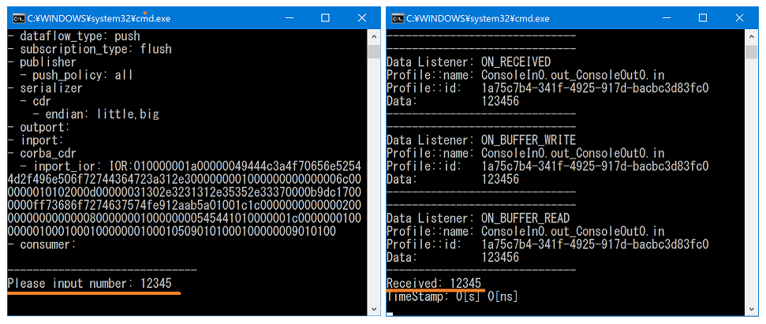
  

<b>動作確認</b>

※数値以外の入力や、大きすぎる数値を入力するとエラー(赤)になります。コンポーネントがエラーを起こしたら、RTSystemEditor でコンポーネントを右クリックして [Reset] を選択してください。 

コンポーネントを終了する場合は、ツールバーから [All Deactivate] をクリックします。その後、コンポーネントを右クリックして [Exit] してください。 
※Deactivate に時間がかかる場合は ConsoleIn の数値入力で止まっているので、何か数値を入力してください。 

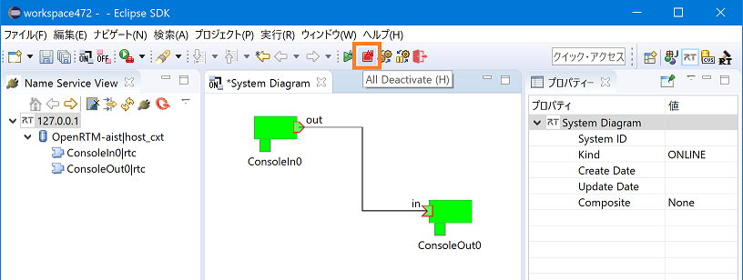

<b>コンポーネントの非アクティブ化</b>

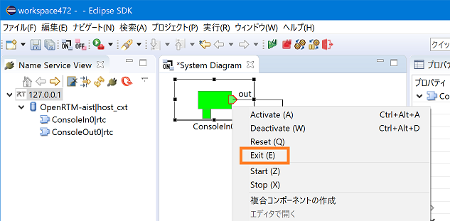

<b>コンポーネントの終了</b>

以上で ConsoleIn と ConsoleOut を使用した動作確認は終了です。

### rtshell を利用する

OpenRTM-aist-1.2.0 では rtshell が標準でインストールされます。 rtshell を利用することでコマンドラインから RTC のアクティブ化、非アクティブ化、終了等ができるようになります。

※64bit版をインストールした場合に dll の不足により動作できない場合があります。その場合は Windows Update を実行してください。

#### RTC の操作
サンプルコンポーネントを起動し、rtshell によりコマンドラインからデータポートの接続、RTC のアクティブ化、非アクティブ化、終了を行います。

#### rtm-naming を起動
[OpenRTM-aist 1.2.0 x86] フォルダー内の Start Naming Service をクリックして起動します。

#### サンプルコンポーネント の起動
まずはサンプルコンポーネントを起動して、起動したコンポーネントを rtshell で操作します。 [OpenRTM-aist 1.2.0 x86] > [Python_Examples] フォルダー内の ConsoleIn.bat と ConsoleOut.bat をクリックするとコンソール画面が起動します。

#### コマンドプロンプトからの操作
次にスタートメニューから [Windows システム ツール] > [コマンドプロンプト] を起動してください。

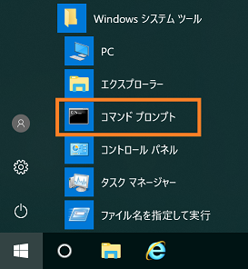

<b>コマンドプロンプトの起動</b>

まず、C:\Python27\Scripts にパスを設定していない場合は以下のコマンドでパスを設定してください。

 set PATH=C:\Python27\Scripts;%PATH%
次に以下のコマンドでデータポートを接続します。

 rtcon /localhost/ConsoleIn0.rtc:out /localhost/ConsoleOut0.rtc:in
すると ConsoleIn.py、ConsoleOut.py コンソールに以下のような文字列が表示されます。

    Listener:        ON_CONNECT
    Profile::name:   outin
    Profile::id:     4d622f80-135f-11e6-b923-001c4231a7a3

念のため RTSystemEditor で確認します。
NameServiceView のコンポーネントをSystem Diagramにドラッグ＆ドロップすると、データポートが接続されたことが確認できます。

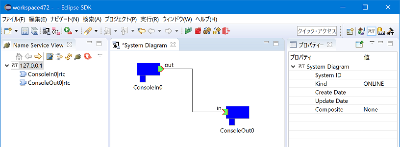

<b>データポート接続の確認</b>

次に、以下のコマンドで RTC をアクティブ化します。

    rtact /localhost/ConsoleIn0.rtc /localhost/ConsoleOut0.rtc

アクティブ化に成功していると ConsoleIn.py コンソールに「Please input number:」と表示されます。 RTSystemEditor を見ると、RTC がアクティブ化されたことが確認できます。 

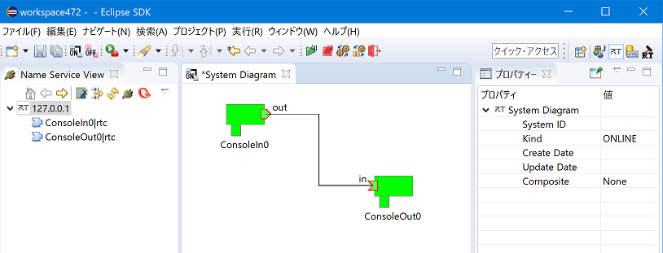

<b>アクティブ化の確認</b>

そして ConsoleIn.py 画面で数値を入力し [Enter] を押すと、ConsoleOut.py 画面に数値が表示されます。

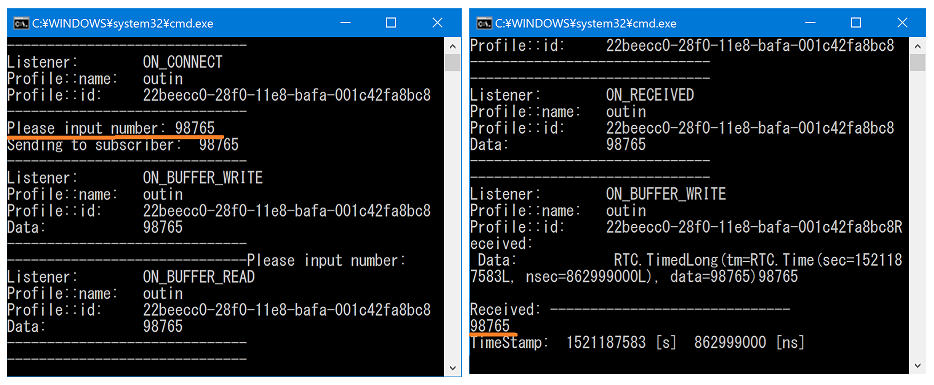
  

<b>ConsoleIn.py と ConsoleOut.py</b>

以下のコマンドで RTC を非アクティブ化してください。

    rtdeact /localhost/ConsoleIn0.rtc /localhost/ConsoleOut0.rtc

※ConsoleIn が非アクティブ化できない場合、数値入力で止まっているので何か数値を入力してください。

最後に以下のコマンドで RTC を終了させてください。

    rtexit /localhost/ConsoleIn0.rtc

    rtexit /localhost/ConsoleOut0.rtc
