## VCVerChanger
### 概要

本ツールは、OpenRTM-aist 1.2.0 版以降のインストーラーに含まれており、下記のケースに対応しています。

- OpenRTM-aist で使用する Visual Studio のバージョンを変更したい
- OpenRTM-aist の32bit 版、64bit 版を両方インストールしているが、切り替えて使いたい。

OpenRTM-aistは、32bit 版も64bit 版も同じ名前のシステム環境を利用しています。またパスを通すために PATH にも追加しています。 このため、32bit 版、64bit 版の両方をインストールしたり、一方をアンインストールしたりすると、システム環境変数の書き換えが必要となる場合があります。

このような場合に本ツールを起動して [確認] ボタンをクリックすると、正しいシステム環境変数に修正します。

本ツールのログを、起動画面に示している先に出力しています。毎回上書きしているので直前の実行内容だけですが確認することができます。

### インストールおよび起動

インストール後にスタートメニューから起動できます。VCVerChanger で検索しての起動もできます。

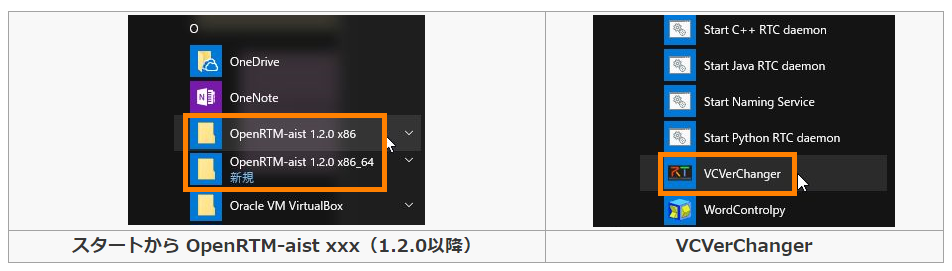

### Visual Studio のバージョン更新手順

本ツールを起動し、[確認] ボタンをクリックします。ここで示している画像は、OpenRTM-aist の 32bit 版だけをインストールしている環境での結果です。 

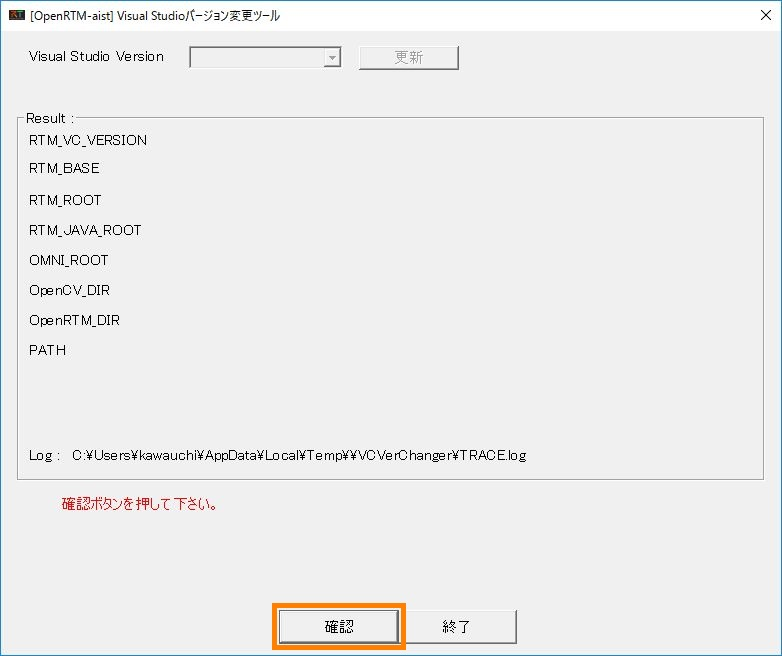

現在のシステム環境変数の設定が表示されます。一番上の Visual Studio Version がインストールしているバージョンと一致しているか確認します。 

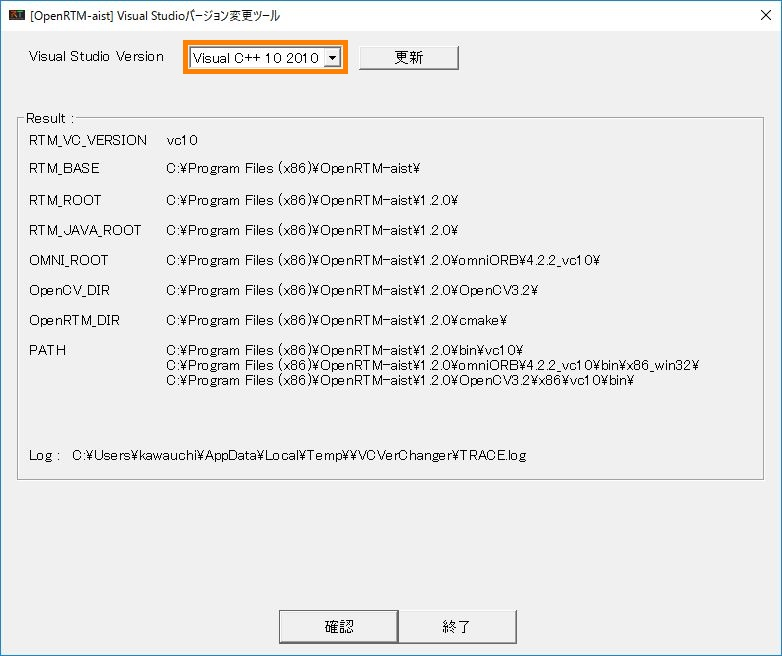

変更する場合は、下記のようにリストから選択し、[更新] ボタンをクリックします。 

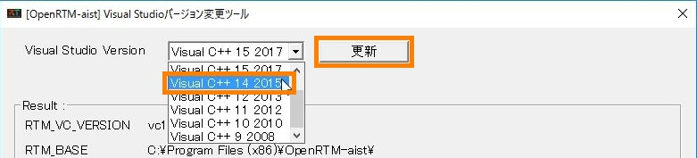

変更後の設定が表示されますので、指定した RTM_VC_VERSION の値がパスに反映されていることを確認し、[終了] ボタンをクリックします。 

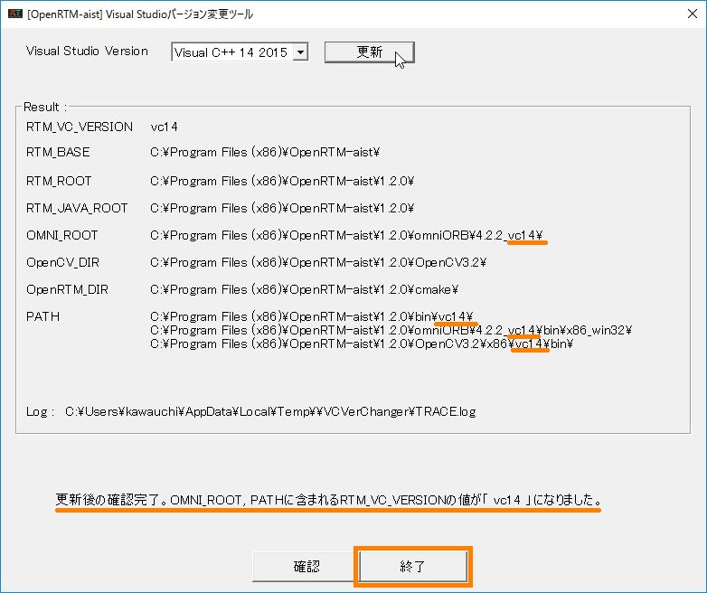

## OpenRTM-aist の 32bit、64bit パスの切替手順

32bit 版と 64bit 版を続けてインストールした場合、本ツールを起動して [確認] ボタンをクリックします。 現在のシステム環境変数の設定が表示され、PATH に両方の設定が混ざって追加されていることを確認できます。 

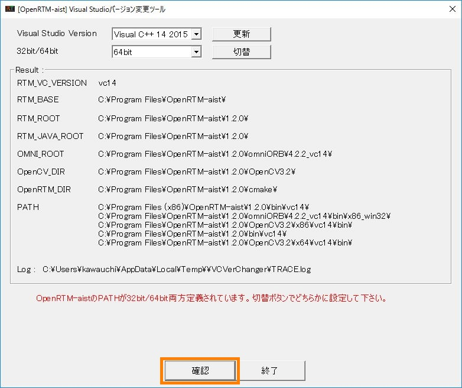

32bit、64bit のどちらかを選択し、[切替] ボタンをクリックします。 

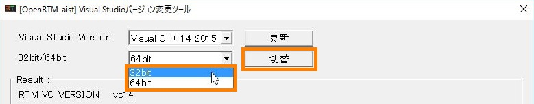

切り替え後の設定が表示されますので、パスを確認し [終了] ボタンをクリックします。 

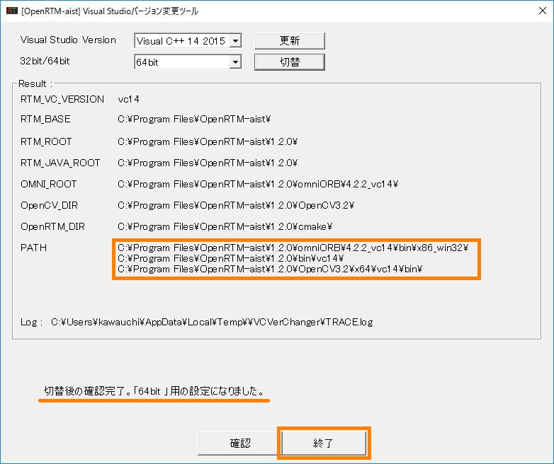

### OpenRTM-aist 1.1.2版用のツール OpenRTMEnvTool

### ダウンロード

本ツールの実行には、mfc の dll が必要です。この dll を別途インストールせずともツールを実行するために、2種類の実行ファイルを用意しています。 ご使用の Visual Studio のバージョンに合わせてダウンロードしてください。

| VS Version    | URL                                      |
|:--------------|:-----------------------------------------| 
|Visual Studio 2008,2010,2012 向け|OpenRTMEnvTool_vc10.exe |
|Visual Studio 2013,2015 向け	  |OpenRTMEnvTool_vc12.exe |

### 使い方

ダウンロードした exe ファイルを実行すると以下の画面が表示されるので、[確認] ボタンをクリックします。 

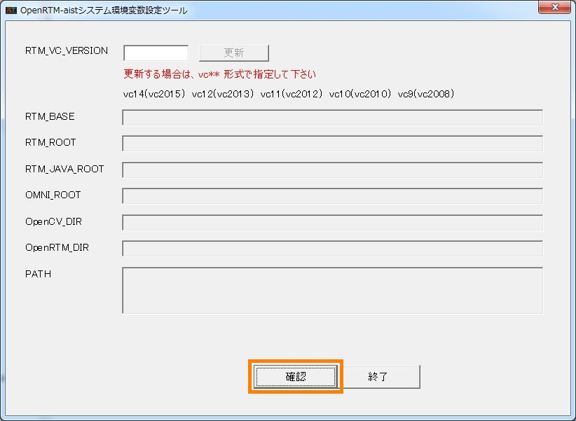

現在のシステム環境変数の設定が表示されるので、一番上の「RTM_VC_VERSION」の設定がインストールしている Visual Studio のバージョンと一致しているか確認します。 

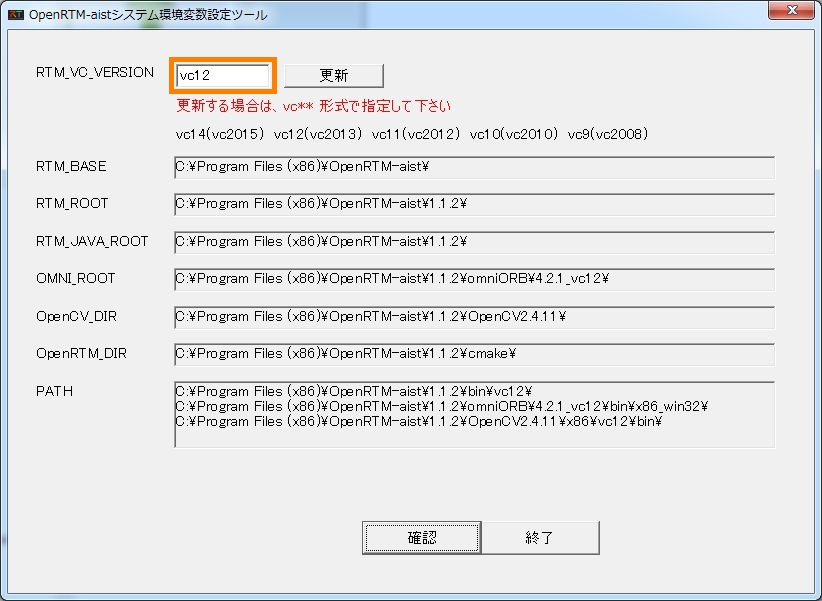

「RTM_VC_VERSION」の設定を vc14 (vc2015用）に変更する場合は、下記のように指定し、[更新] ボタンをクリックします。 

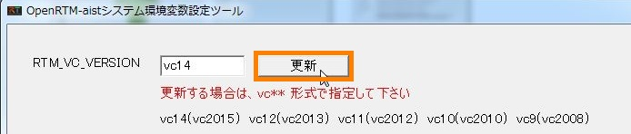

変更後の設定が表示されますので、指定した RTM_VC_VERSION の値がパスに反映されていることを確認し、[終了] ボタンをクリックします。 

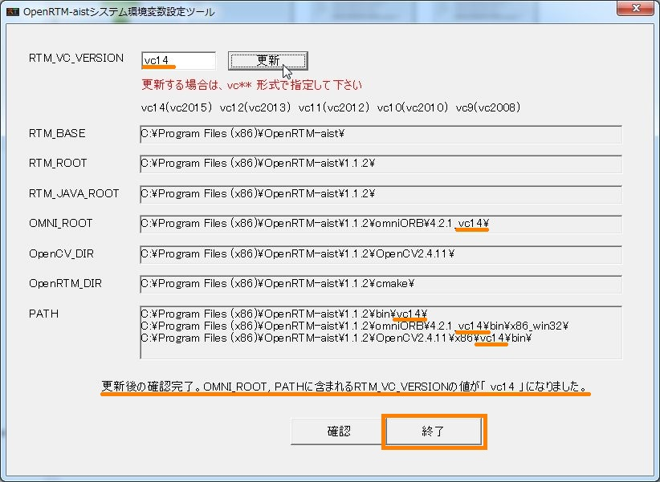

