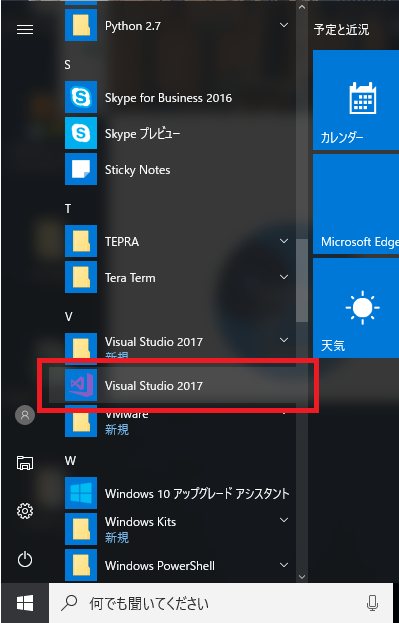

## Visual Studio 2017 インストール方法

本ドキュメントではVisualStudio2017コミュニティ(無償版)のインストール方法を説明します。

2017年3月8日リリースされたVisualStudio2017はインストーラの軽量化が図られ、デフォルトインストールにVC++は含まれません。 VC++をインストールしたい場合は以下の手順でインストールを完了してください。

RTM講習会へ参加する方は、最後の「VisualStudio2017 を起動する」までご確認の上ご来場ください。

### Microsoftアカウントに登録する

VisualStudio2017コミュニティ(無償版)を利用するためにMicrosoftアカウントが必要です。

未登録の方は、こちらから登録を完了してください。

1. 以下の画面で必要な情報を入力し、最後に「アカウント作成」ボタンを押下します。

<b>アカウント作成ページ</b>

2. 情報に不備が無ければ次の画面を表示しますので、「メールの送信」をクリックします。メールが届かない場合、「メールの再送信」ボタンで再送信します。

<b>メールの送信</b>

3. 次にMicrosoftからのメールを確認します。メールの「(メールアドレス)の確認」をクリックし確認を完了します。

<b>確認メール</b>

<b>メールアドレスの確認完了</b>

コミュニティ(無償版)を利用中もMicrosoftアカウントが必要になる場合があります。メールアドレスとパスワードは忘れずに保管してください。

4. 以上でMicrosoftアカウントの登録は完了です。ブラウザを閉じて終了します。

### インストーラを取得する

1. マイクロソフト公式サイトからインストーラをダウンロードします。

「VisualStudioのダウンロード」の「コミュニティ」から「vs_community__1100323626.1489559297.exe」をダウンロードします。

<b>VisualStudioのダウンロードページ</b>

### インストールを実行する

1. ダウンロードした「vs_community__1100323626.1489559297.exe」を管理者アカウントで実行します。

※お使いのアカウントが管理者アカウントでない場合、shiftキーとCtrlキーを押下しながら右クリックし「管理者として実行」することも可能です。「管理者として実行」する場合、管理者パスワードが必要です。お使いのPCのシステム管理者にご確認ください。

2. 「はい」を選択して進みます。

<b>インストール開始</b>

3. ライセンスを確認し「続行」を選択して進みます。

<b>ライセンス確認</b>

4. 次の画面が表示されたら「C++によるデスクトップ開発」にチェックを入れ、インストールを進めます。

<b>C++を追加</b>

5. 次の画面が表示されたら「再起動」を選択しWindowsを再起動します。

<b>インストール完了</b>

次に、VisualStudio 2017 を起動します。

### VisualStudio2017を起動する

VisualStudio2017 は初回起動時にMicrosoftアカウントを確認します。

RTM講習会に参加する方はMicrosoftアカウントの登録、及び VisualStudio2017 の起動を確認してからご参加ください。

1. 左下「Windows」メニューの「VisualStudio2017」からソフトウェアを起動します。

<b>VisualStudio2017起動</b>

2. 次の画面が表示されたら、Microsoftアカウントでサインインします。

<b>起動時にサインイン</b>

3. 次の画面が表示されたら完了です。右上の「×」ボタンでソフトウェアを終了します。

<b>VisualStudio2017 スタート画面</b>
